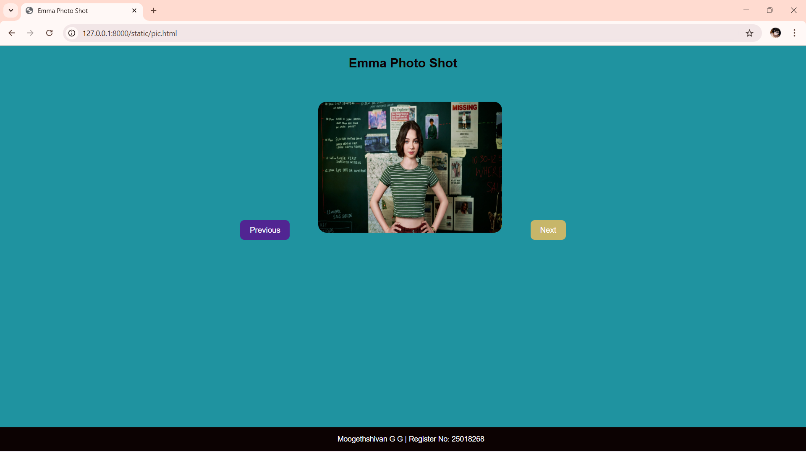

# Ex.07 Design of Interactive Image Gallery
## Date:17-03-2026

## AIM:
To design a web application for an inteactive image gallery for a minimum five images with next and previous buttons.

## DESIGN STEPS:

### Step 1:
Clone the github repository and create Django admin interface.

### Step 2:
Change settings.py file to allow request from all hosts.

### Step 3:
Use CSS for positioning and styling.

### Step 4:
Write JavaScript program for implementing interactivity.

### Step 5:
Validate the HTML and CSS code.

### Step 6:
Publish the website in the given URL.

## PROGRAM:
```

<html>
<head>
<title>Emma Photo Shot</title>

<style>
body{
    text-align:center;
    font-family:Arial;
    background-color:#1f93a0;
    padding-bottom:60px; /* prevents overlap with footer */
}

h2{
    margin-top:20px;
    color:#0c0202;
}

.gallery-box{
    margin-top:60px;
}

img{
    width:350px;
    height:250px;
    border-radius:16px;
    margin:0 50px;
}

button{
    padding:10px 18px;
    font-size:15px;
    border:none;
    background-color:#512592;
    color:white;
    border-radius:8px;
    cursor:pointer;
}

button:hover{
    background-color:#c7b669;
}


footer{
    position:fixed;
    bottom:0;
    left:0;
    width:100%;
    padding:15px;
    background-color:#0c0202;
    color:white;
    font-size:14px;
}
</style>

</head>

<body>

<h2>Emma Photo Shot</h2>

<div class="gallery-box">
    <button onclick="prevImage()">Previous</button>

    

    <button onclick="nextImage()">Next</button>
</div>

<footer>
    Moogethshivan G G | Register No: 25018268
</footer>

<script>
let images = [
    "076400c57b567c520dd552c9913a20de.jpg",
    "Screenshot 2026-03-17 104840.png",
    "wallpapersden.com_actress-emma-myers-a-good-girl-s-guide-to-murder_3840x2160.jpg",
    "wp11862812.jpg",
    "wp14157896.jpg"
];

let index = 0;

function showImage(){
    document.getElementById("galleryImage").src = images[index];
}

function nextImage(){
    index++;
    if(index >= images.length){
        index = 0;
    }
    showImage();
}

function prevImage(){
    index--;
    if(index < 0){
        index = images.length - 1;
    }
    showImage();
}
</script>

</body>
</html>
body{
    text-align:center;
    font-family:Arial;
    background-color:#f0f0f0;
}

h2{
    margin-top:40px;
    color:#333;
}

.gallery-box{
    margin-top:40px;
}

img{
    width:400px;
    height:250px;
    border-radius:10px;
    margin:0 40px;
}

button{
    padding:10px 20px;
    font-size:16px;
    border:none;
    background-color:#007bff;
    color:white;
    border-radius:5px;
    cursor:pointer;
}

button:hover{
    background-color:#0056b3;
}

```
cd..

## OUTPUT:

## RESULT:
The program for designing an interactive image gallery using HTML, CSS and JavaScript is executed successfully.
